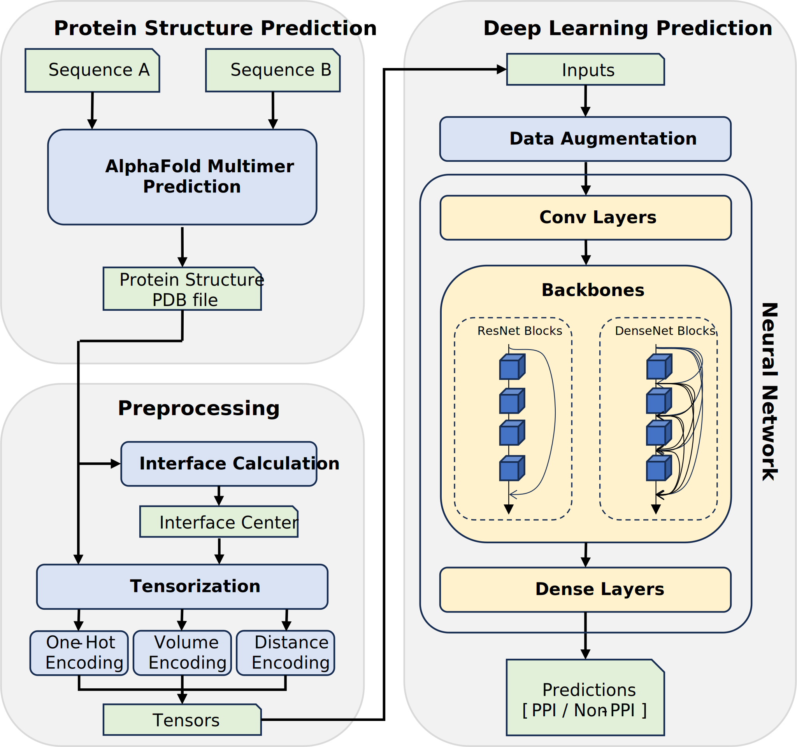

# SpatialPPI: Three-dimensional Space Protein-Protein Interaction Prediction With AlphaFold Multimer

## Overview



## How to use

### Install environment

Using [Conda](https://www.anaconda.com/):

`conda create -f spatial-ppi.yaml`

Then, activate the environment

`conda activate spatial-ppi`

### Prepare dataset

1. Prepare a dataset in `json` format, [example](https://github.com/ohuelab/SpatialPPI/blob/main/data/example_dataset.json)
2. Perform Alphafold Multimer prediction
3. Run `preprocess.py` to generate tensors and data list files

```bash
python preprocess.py \
--dataset [PATH to the json dataset] \
--data_dir [PATH to Alphafold Multimer prediction result folder] \
--work_dir [PATH to folder to save tensors and data files] \
--tensor_method [Methods for tensorization, choices: onehot, volume, distance, all] \
--split \ # Generate splited train, val and test dataset for 5-fold cross validation
--relaxed \ # Use relaxed Alphafold Multimer predictions
--threads [Number of threads to run] \
--models_per_pair [Number of Alphafold multimer models generated per protein pair]
```


### Run SpatialPPI for training

Run `train.py` to train models

```shell
python train.py \
--model [Backbone model to use] \
--datapath [PATH to data tensors] \
--weights [PATH to weights to fine-tuning] \
--savingPath [PATH to save trained models] \
--train_set [PATH to train set csv file generated in preprocess] \
--val_set [PATH to validation set csv file generated in preprocess] \
--augment [Number of times of augmentation, 0 for off]
```


### Run Spatial PPI for testing

`test.py` could use trained model to make predictions and evaluations

```shell
python test.py \
--model [Backbone model to use] \
--datapath [PATH to data tensors] \
--weights [PATH to weights to fine-tuning] \
--output [PATH to save prediction results] \
--testset [PATH to test set csv file generated in preprocess]
```


## Citation

If you find SpatialPPI useful, please consider citing our publication:

